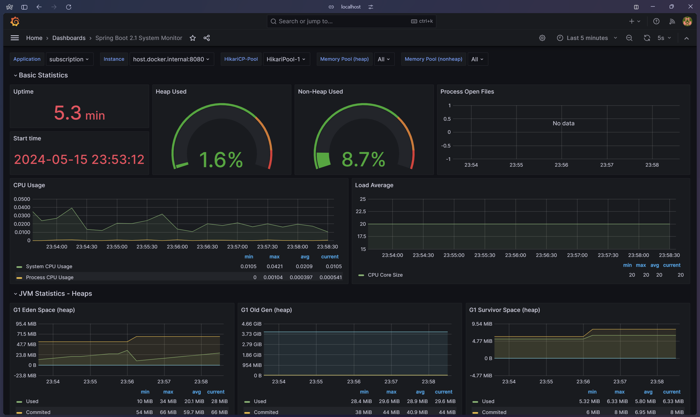
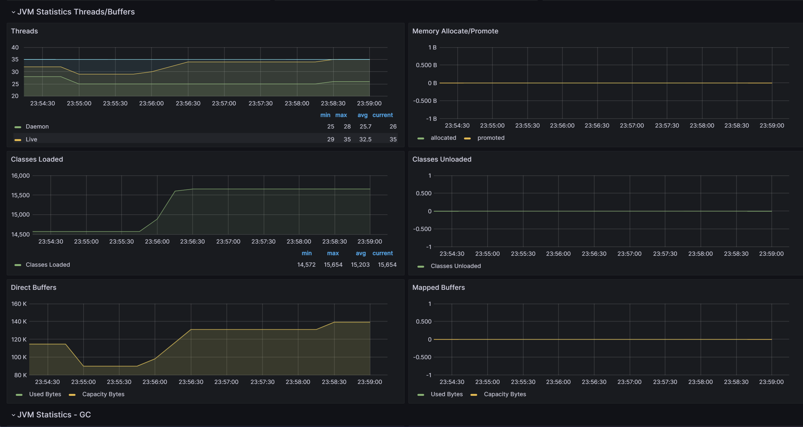
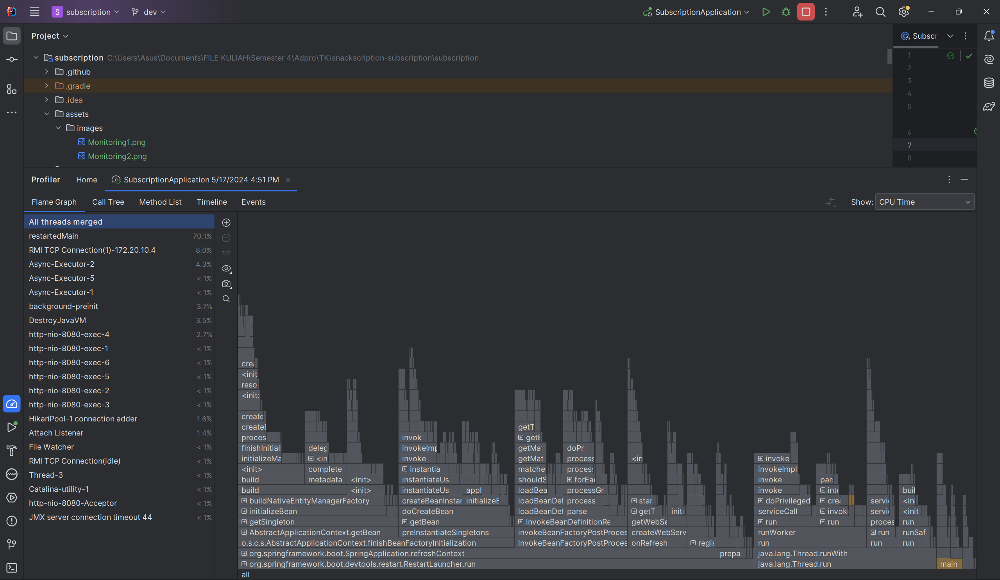
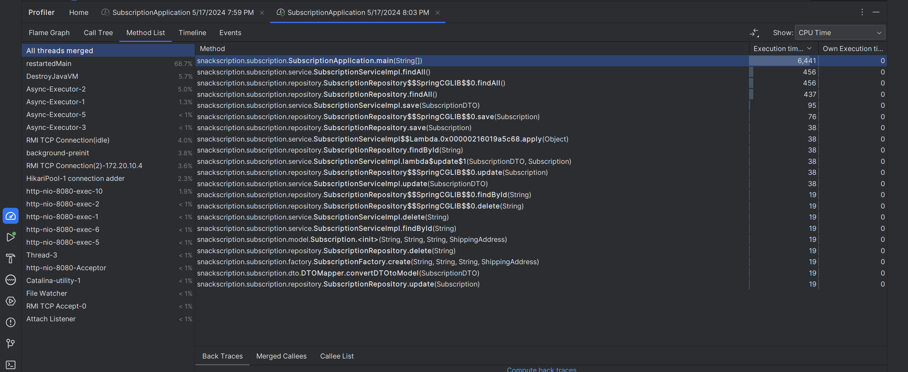

# Snackscription - Subscription Management (User)
**Reyhan Zada Virgiwibowo - 2206081723 - Advanced Programming C**

#### Deployment Link : http://34.87.187.73/subscription

#### Fitur : 
- Membuat Subscription (C) http://34.87.187.73/subscription/create
- Melihat Subscription (R) http://34.87.187.73/subscription/list
- Mengubah Subscription (U) http://34.87.187.73/subscription/update
- Menghapus Subscription (D) http://34.87.187.73/subscription/delete

#### Design Pattern Implemented:
- Factory Pattern
- Data Transfer Object Pattern

#### Software Architecture:
- Microservice Architecture
- Supabase

#### High-Level Networking:
- REST API

### Asynchronous Programming:
- Spring Async Annotations

#### Deployment:
- Google Cloud Platform
- Docker

#### Monitoring:
Monitoring dilakukan dengan menggunakan Grafana

#### Profiling:
Profiling dilakukan dengan menggunakan IntelliJ Profiler

Berdasarkan hasil profiling, salah satu bottleneck berada pada method findAll(). Hal tersebut terjadi karena method findAll() harus mengambil seluruh data yang berada pada dalam database. Untuk progress selanjutnya, saya akan memperbaiki algoritma dan meningkatkan execution time dari setiap bottle neck pada service saya.